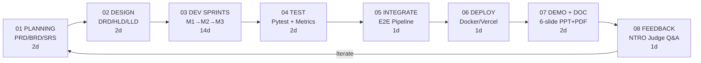
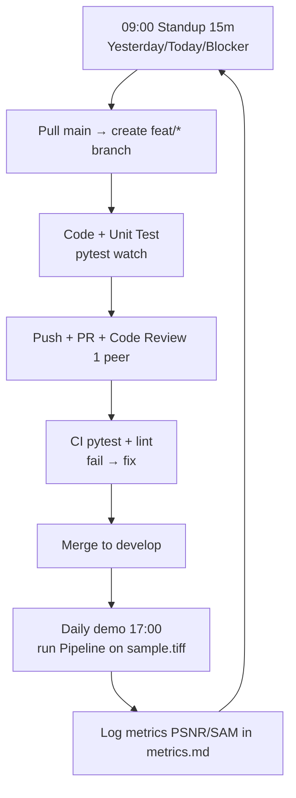
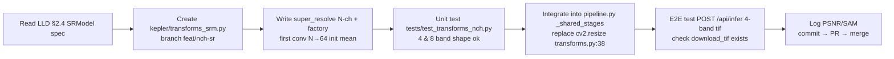
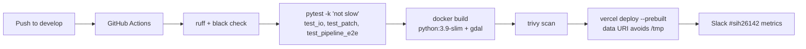
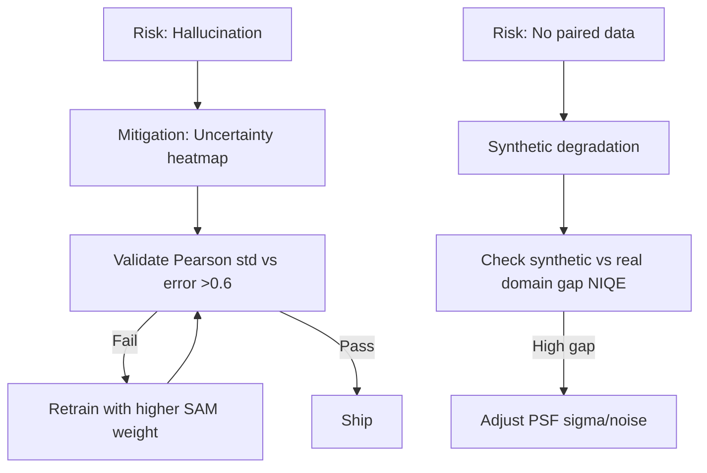

# Development Working Cycle / Flow
## SIH26142 Sentinel-SRM (Kepler-404 Fork) — Agile SDLC for 3-Week SIH Sprint

**Product:** 10m Sentinel-2 → <4m SRM + Uncertainty | **Repo:** `Kepler-404/` fork → `sih26142-sentinel` branch | **Stack:** Flask + Rasterio + PyTorch ESRGAN/SwinIR  
**Team:** 4 (2 DL + 1 Geospatial + 1 Full-stack) per `prompt.txt:71-81` | **Cycle:** 3 sprints × 1 week, daily 15m standup + weekly SIH mentoring

---

## 1. Overall Development Cycle (End-to-End)



**Total 3 weeks (21d) maps to `prompt.txt:14` feasible if data download not 24h + SIH deadlines `SIH2026_About_SIH.md:15-24`.**

---

## 2. Phase Breakdown with Deliverables

| Phase | Days | Owner | Input | Output | Exit Criteria |
|---|---|---|---|---|---|
| **P1 Planning** | D1-2 | All | PRD `01_PRD.md`, prompt `prompt.txt:45-52` | Backlog + synthetic data plan | PRD approved, SpaceNet download started |
| **P2 Design** | D3-4 | Geospatial+Full-stack | DRD/TRD | Patch spec 256+16, N-ch model spec, API contract | HLD/LLD reviewed |
| **M1 Sprint: I/O + Tiling** | D5-7 | Geospatial + DL | `kepler/io.py:55-65` single-band bug | `patch.py` + N-band `io.py` fix + 10k synthetic tiles | Tile stitch RMSE <1 DN, read 4-band ok |
| **M2 Sprint: Model Train** | D8-14 | 2 DL | Synthetic pairs | Weights `real_esrgan_4ch.pth`, loss `L1+Perceptual+SAM` `prompt.txt:88` | PSNR≥28 SAM<3° on holdout |
| **M3 Sprint: Viewer + Uncertainty** | D15-17 | Full-stack + DL | M2 weights | 4-layer viewer + heatmap MC T=10 + metrics card | Demo 1024×1024 ≤30s CPU |
| **Test** | D18-19 | All | Pipeline | `pytest` green + NDVI r>0.98 | No regression on `sample.tiff` |
| **Integrate** | D20 | All | All modules | E2E `POST /api/infer` → COG + JSON | QGIS overlay RMSE <0.3px |
| **Deploy** | D21 | Full-stack | Docker | Vercel live + on-prem image + PDF | `http://kepler-404-srm.vercel.app` live |
| **Demo** | D22 | All | Deploy | 6-slide PPT per `sih py ppt.txt:8-36` + speaker script | SIH portal PDF uploaded |

---

## 3. Sprint Working Cycle (Daily Loop)



**Branching (GitFlow-lite from `Kepler-404/.git`):**

```
main (protected, deploy) ← develop (integration) ← feat/patch-tiling, feat/nch-sr, feat/uncertainty, feat/metrics
                           ← hotfix/crs-preserve
Tags: v0.1-m1, v0.2-m2, v1.0-sih
```

**PR Rules:** 1 approver, `pytest` must pass (`Kepler-404/.pytest_cache`), no direct push to `main`.

---

## 4. Development Flow per Feature (Example: N-Channel SR)



**Parallel Tracks:**

* Geospatial track: `io.py` N-band + `patch.py` + `datasets.py` synthetic
* DL track: `transforms.py` + `weights/` + `metrics.py`
* Frontend track: `templates/index.html` 4th layer + `static/js/script.js` slider

Merge at end of M2 via `develop` integration test.

---

## 5. CI/CD Flow



**On `main` tag:** Auto build on-prem image `kepler-srm:1.0` + PDF artifact.

---

## 6. Testing Working Cycle

| Level | When | Tool | Assert |
|---|---|---|---|
| Unit | Per commit | `pytest` | `read_geotiff` CRS roundtrip `kepler/io.py:104-142`, `patch` seam RMSE<1 |
| Integration | Per PR | `pipeline.run(sample.tiff)` | JSON has `heatmap`, `metrics` |
| Validation | Nightly | `datasets.py` holdout 100 tiles | PSNR≥28 SAM<3° NDVI delta <0.02 |
| Acceptance | Sprint end | Manual QGIS overlay | RMSE <0.3px, NDVI calculable `prompt.txt:68` |
| SIH Mock | Before submit | Judge Q&A `prompt.txt:106-115` | Answer bridge/8-band/GB stitch verbally |

---

## 7. Daily / Weekly Cadence

* **Daily 09:00:** Standup board (To Do / In Progress / Review / Done), update `session.txt` (`Kepler-404/session.txt` pattern).
* **Daily 17:00:** 5-min demo on real Sentinel-2 tile, log elapsed + metrics.
* **Weekly Friday:** Sprint review + retro, re-estimate via `SIH2026_Difficulty_Levels.md` Medium baseline, mentor sync `SIH2026_About_SIH.md:59`.
* **Continuous:** Handle `mock_delay_seconds` 0 prod, keep `purge_stale` 24h `Kepler-404/README.md:284`.

---

## 8. Risk-Driven Working Cycle (Feedback Loops)



---

## 9. Release Cycle to SIH Portal

```
develop green → PR to main → tag v1.0-sih → GitHub Release with weights (LFS) + PDF (6 slides per SIH2024_IDEA_Presentation_Format.pptx:Slide7 rules) → Export PDF (no PPT) → Upload https://sih.gov.in/sih2026PS → Demo URL kepler-404.vercel.app
```

**Definition of Done (SIH Internal):**

* [ ] N-band GeoTIFF in → COG out with `Affine.scale` CRS `kepler/pipeline.py:87`
* [ ] SAM <3°, uncertainty Pearson >0.6, pipeline handles 8-band on-spot `prompt.txt:98`
* [ ] 6-slide PDF + live demo URL + metrics report

---

*This cycle maps 1:1 to TDD §10 Testing, SDD §10, flow.md §3-5 pipelines. Keep cycle tight: 75% code 25% doc per sprint.*
