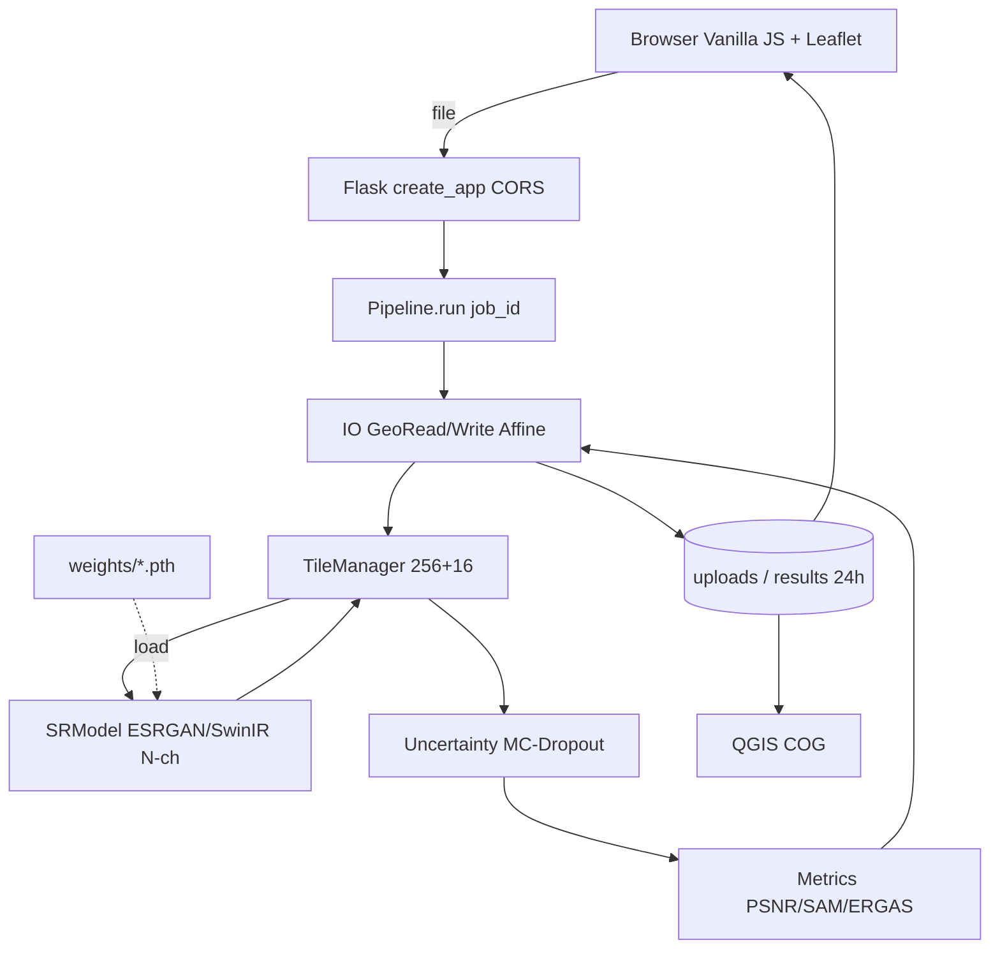
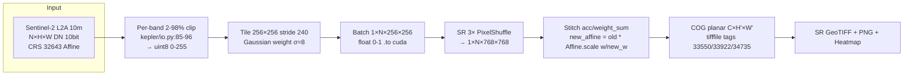
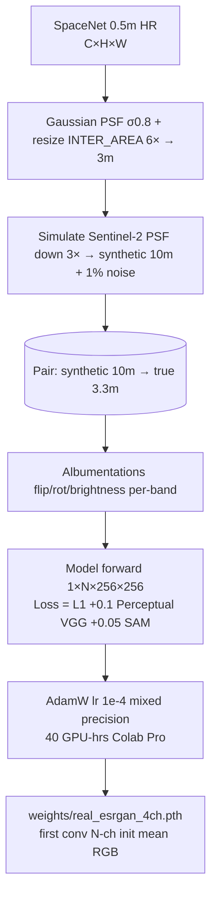
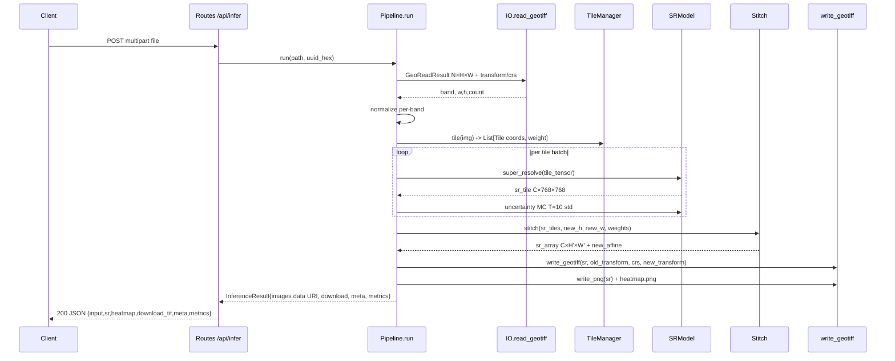
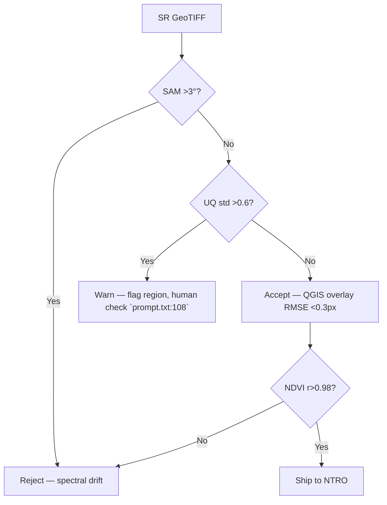

# FLOW — End-to-End System & Data Flows
## SIH26142 Sentinel-SRM (Kepler-404 Fork) 10m Sentinel-2 → <4m (3×)

**Product:** Sentinel-SRM | **PS:** SIH26142 NTRO Space Technology | **Base:** `Kepler-404/` Flask+Rasterio 200→100m → N-channel Sentinel-2
**Files Ref:** `kepler/pipeline.py:32-91`, `kepler/io.py:55-142`, `kepler/transforms.py:34-45`, `prompt.txt:45-52/88/103/115`

---

## 1. User Journey Flow

```mermaid
flowchart LR
    A[Analyst / Evaluator opens kepler-404.vercel.app] --> B{Has 10m GeoTIFF?}
    B -->|Yes| C[Drag-drop 4-band .tif ≤50MB]
    B -->|No| D[Click sample: Urban / Ocean / Desert]
    C --> E[POST /api/infer multipart]
    D --> E
    E --> F[Loader + job_id short 8 chars]
    F --> G[4-Layer Viewer: Input 10m | SR 3.3m | Heatmap | Diff]
    G --> H{Trust heatmap?}
    H -->|Low uncertainty| I[Download COG GeoTIFF + PNG + Metrics JSON]
    H -->|High uncertainty| J[Flag red overlay, re-run or discard]
    I --> K[Open in QGIS/ArcGIS overlay check]
```

**Key touchpoints:** `templates/index.html` drag-drop, `POST /api/infer` (`Kepler-404/README.md:167`), data URI renders (`kepler/pipeline.py:190-193`) avoids Vercel /tmp, toast on `DecodingError` (`Kepler-404/README.md:204`).

---

## 2. High-Level System Flow (HLD)



**Deployment:** Dev `python app.py` auto-reload (`Kepler-404/README.md:161`), Prod `gunicorn` Docker + GDAL, Vercel edge for demo.

---

## 3. Data Flow (N-Band)



**State change example:** 1024×1024×4 input → 16 tiles (4×4 grid) → 3072×3072×4 output. Transform `xres 10m → 3.33m`, `yres -10m → -3.33m`.

---

## 4. Training Flow (Offline, Synthetic Degradation `prompt.txt:103`)



**Why synthetic:** Real paired 10m↔3m same-day does not exist publicly (`prompt.txt:101`). Synthetic gives perfect pairs; validated on held-out real Sentinel-2 unpaired via NIQE/PIQE.

---

## 5. Inference Pipeline Flow (Low-Level, `kepler/pipeline.py:42-91` Modified)



**Error branches:** `DecodingError 400`, `ProcessingError 500` (`kepler/pipeline.py:59-63`).

---

## 6. Tiling & Uncertainty Sub-Flows

**Tiling:**
```
Input C×H×W → for y in 0..H stride240, x in 0..W stride240: crop 256×256 (pad reflect if edge) → weight map Gaussian → acc[C,H',W'] += sr_tile*weight ; weight_sum[H',W'] += weight → final = acc/weight_sum → seam RMSE <1 DN
```

**Uncertainty:**
```
Enable dropout p0.2 in tail only → T=10 forwards on same tile → stack C×H×W×T → mean (SR) + std (heatmap) → normalize std 0-1 → viridis colormap → overlay threshold 0.6 red
```

---

## 7. Metrics Flow

```
If synthetic pair available: sr vs gt → PSNR (MUST ≥28) → SSIM (≥0.80) → LPIPS → SAM mean deg (<3°) → ERGAS (<2.5) → NDVI delta (<0.02)
Else unpaired real: sr vs bicubic vs NIQE/BRISQUE no-reference + NDVI correlation r>0.98
→ JSON metrics → rendered in metrics-card (Mono Consolas, GREEN header per DRD)
```

---

## 8. Decision Flow (Analyst Trust)



---

## 9. Deployment Flow

```
Dev: git clone → venv → pip -r requirements.txt → python app.py → http://127.0.0.1:5000 (debug True)
Train: datasets.py → 10k synthetic tiles → torch train → weights/*.pth
Prod: docker build python:3.9-slim + apt gdal → gunicorn kepler.app:create_app() :5000 → Vercel `vercel.json` or NTRO air-gapped systemd → 24h purge on start
SIH Submit: 6-slide PDF from PPT blueprint → portal upload (PDF only, PPT not allowed per SIH2024_IDEA_Presentation_Format.pptx:Slide7)
```

---

## 10. Failure Flows

| Failure | Detection | Flow |
|---|---|---|
| 8-band on-spot file (`prompt.txt:98`) | `model.in_ch != input.count` | Return 400 + hint "Model 4ch vs input 8ch — using 4ch mean fallback" |
| OOM 5000×5000×4 | `TileManager` mem check | Force tile batch size 1, stream write memmap |
| CRS lost | `crs is None` after read | Export with `Unknown` + JSON warning, still PNG deliver |
| High hallucination | SAM>3° or UQ>0.6 | Block auto-export, require manual approve |

---

*Traceability: Generated from `01_PRD.md` PR-03/04/05, `06_TRD.md` §2/7, `09_SDD.md` §6-7, `Kepler-404` audit. Keep tiling + SAM + uncertainty as non-negotiable per `prompt.txt:42/88/115`.*
